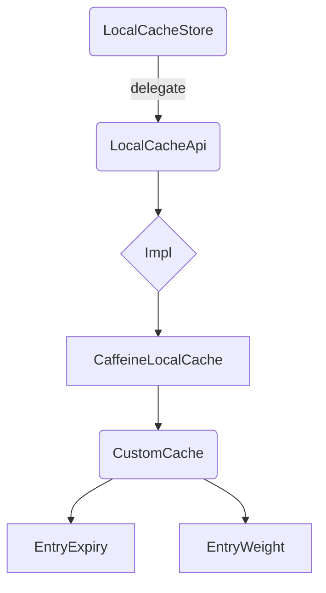

# Easy-Caffeine

Easy-Caffeine is a lightweight, flexible, and easy-to-use local caching framework based on Caffeine.
> A lightweight, pluggable **local cache** component powered by [Caffeine](https://github.com/ben-manes/caffeine), supporting per-entry TTL and memory-aware eviction.

---

## Why?
*Origin & Motivation*

* **Limitations of Native Caffeine** –
    * Only supports **uniform TTL** (`expireAfterWrite`/`expireAfterAccess`), unable to specify independent expiration times for different entries
    * Default eviction based on **entry count** or custom *weight*, but weight often uses fixed constants, lacking **fine-grained memory control** based on "actual object byte size"
    * Parameters require `Caffeine.newBuilder()` chain settings, making **centralized global configuration impossible**. Each usage requires new instances and repeated configuration logic

* **Low-Dependency Business Needs** – Many scenarios (configuration caches, hot data) require a simple, reliable local cache rather than heavy Redis/Memcached clusters

* **Learning & Reusing Best Practices** – Provides a reference template for teams to extend caching implementations

---

## What?
*Key Features*

| Feature                | Description                                                                 |
|------------------------|-----------------------------------------------------------------------------|
| **Unified API**        | `LocalCacheApi` abstracts implementations, allowing seamless switching between Caffeine/Redis/custom solutions |
| **Memory-Based Eviction** | Uses Jackson to optimize memory calculation + custom `Weigher` for precise entry sizing |
| **Per-Entry TTL**      | Custom `EntryExpiry` allows each record to specify its own expiration time |
| **Builder & Thread Pool** | `CustomCacheBuilder` supports max memory/weight factor/asynchronous executors |
| **Configurable**       | `LocalCacheStoreConfig.json` defines implementation classes/memory thresholds (hot-reloadable) |
| **Extensible**         | New implementations only require extending `LocalCacheApi` + config update |

---

## How?
*Usage & Implementation*

### 1. Quick Start
```xml
<!-- pom.xml -->
<dependency>
  <groupId>net.lightdata.cache</groupId>
  <artifactId>easy-caffeine</artifactId>
  <version>1.0.1</version>
</dependency>
```

```java
// Get singleton instance
LocalCacheStore cache = LocalCacheStore.getStore();

// Write (expire in 120s)
cache.put("user:1", userObj, 120);

// Read
User user = cache.get("user:1");

// Delete + return old value
User old = cache.remove("user:1");
```

### 2. Run Example

```shell
mvn clean package
```

### 3. Configuration (src/main/resources/LocalCacheStoreConfig.json)
```json
{
"maxMemorySize": 524288000,    // Max weight: 500 MB
"weightMemoryFactor": 3.0,     // Serialization memory multiplier (adjustable)
"className": "impl.api.net.datalight.cache.CaffeineLocalCache"
}
```

### 4. Design Overview

* **LocalCacheStore** – Lazily loads config + singleton management
* **LocalCacheApi**  – Abstraction layer
* **CaffeineLocalCache** – Config→CustomCache converter
* **CustomCache**  – Caffeine core with TTL/weight enhancements
* **EntryExpiry/Weight**  – Policy implementations

### 5. Extension Guide
1. Create class implementing LocalCacheApi (e.g., RedisLocalCache)
2. Constructor initializes with LocalCacheConfig
3. Update className in config JSON
4. Hot-redeploy/restart to activate

### 6. Roadmap
- [ ] Micrometer/Prometheus metrics export
- [ ] Batch operations (putIfAbsent, getAll)
- [ ] Spring Boot Starter

---

## License

Apache-2.0 © 2025 1053459255@qq.com 