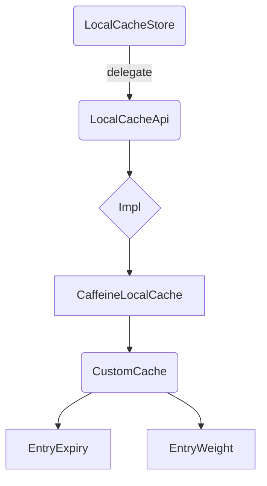

# Easy-Caffeine

easy-caffeine一个简洁灵活易用基于caffeine的本地缓存框架。
> A lightweight, pluggable **local cache** component powered by [Caffeine](https://github.com/ben-manes/caffeine), supporting per-entry TTL and memory-aware eviction.

---

## Why ?  
_为什么会有这个项目_

* **原生 Caffeine 的局限** –
  * 仅支持 **统一 TTL**（`expireAfterWrite` / `expireAfterAccess`），无法为不同条目指定独立过期时间；
  * 默认按 **条目数量** 或自定义 *weight* 进行淘汰，但 weight 多以固定常数衡量，缺乏基于「对象真实字节数」的 **精细化内存控制**；
  * 参数需在 `Caffeine.newBuilder()` 链式设置，项目内 **无法集中式全局配置**，导致每处使用都要 new 实例并重复配置逻辑，无法管理全局内存占用。
* **业务需要低依赖、易接入** – 线上很多场景（配置缓存、热点数据）只需一个简单可靠的本地缓存，而不是沉重的 Redis/Memcached 集群。
* **想要学习 & 复用 Caffeine 的最佳实践** – 给团队一个可参考、可拓展的缓存封装模板。

---

## What ?  
_项目提供了什么功能_

| 功能 | 说明                                                                        |
|------|---------------------------------------------------------------------------|
| **统一 API** | `LocalCacheApi` 屏蔽实际实现，调用方无感知切换 Caffeine/Redis/自研方案                       |
| **内存权重淘汰** | 通过 Jackson 优化计算内存占用，高性能安全可靠 + 自定义 `Weigher` 精准估算条目大小，按「总内存」而非「条目数」限制缓存 |
| **单条 TTL** | 自定义 `EntryExpiry`，每条记录可指定独立过期时间                                           |
| **Builder + 线程池** | `CustomCacheBuilder` 支持设置最大内存/权重因子/异步执行器                                  |
| **可配置化** | `LocalCacheStoreConfig.json` 描述实现类、内存阈值、权重因子，生产可热更新                       |
| **可扩展** | 新增缓存实现只需实现 `LocalCacheApi` 并在配置中声明即可                                      |

---

## How ?  
_如何使用 & 如何实现_

### 1. 快速上手

```xml
<!-- pom.xml 引入 -->
<dependency>
    <groupId>com.github.ben-manes.caffeine</groupId>
    <artifactId>caffeine</artifactId>
    <version>2.5.5</version>
</dependency>
```

```java
// 读取默认配置并获取单例
LocalCacheStore cache = LocalCacheStore.getStore();

// 写入：过期 120 秒
cache.put("user:1", userObj, 120);

// 读取
User user = cache.get("user:1");

// 删除（并返回旧值）
User old = cache.remove("user:1");
```

### 2. 运行示例

```shell
mvn clean package
java -cp target/easy-caffine-1.0-SNAPSHOT.jar net.lightdata.cache.TestMain
```

### 3. 配置说明 (`src/main/resources/LocalCacheStoreConfig.json`)

```json
{
  "maxMemorySize": 524288000,            // 最大权重 ≈ 500 MB
  "weightMemoryFactor": 3.0,            // 序列化大小内存放大系数
  "className": "impl.api.net.datalight.cache.CaffeineLocalCache" // 缓存实现类，可替换
}
```

### 4. 设计概览



* **LocalCacheStore** – 延迟加载配置并持有单例；
* **LocalCacheApi** – 缓存操作抽象；
* **CaffeineLocalCache** – 将配置转为 `CustomCache`；
* **CustomCache** – 封装 Caffeine，支持单条 TTL & 权重；
* **EntryExpiry / EntryWeight** – 过期与权重策略自定义实现。

### 5. 扩展指南

1. 新建类实现 `LocalCacheApi`，如 `RedisLocalCache`  
2. 构造函数接收 `LocalCacheConfig` 并初始化内部客户端  
3. 在 `LocalCacheStoreConfig.json` 修改 `className` 为新实现的全限定名  
4. 热部署或重启即可切换实现

### 6. Roadmap

- [ ] 导出指标到 Micrometer / Prometheus
- [ ] 支持 `putIfAbsent`、`getAll` 批量接口
- [ ] 提供 Spring Boot Starter

---

## License

Apache-2.0 © 2025 1053459255@qq.com 